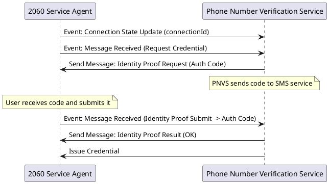
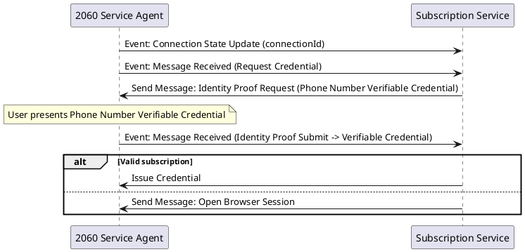
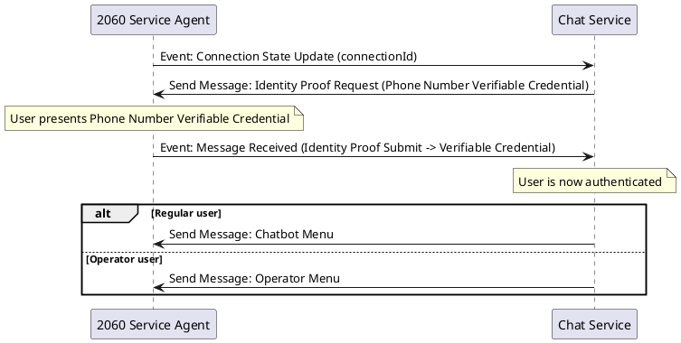

# Service Agent API

This document describes the main interface between a 2060 Service Agent instance and the backend that controls it.

Service Agent API consists on a REST-like interface that exposes endpoints to:

- Send messages to other agents
- Register new credential types on Verifiable Data Registry
- Query connections, credentials and messages emitted or received
- Configure agent

In addition, it supports a notification mechanism to subscribe to any event the consumer is interested in, through either HTTP Webhooks (POST endpoints exposed by the consumer) or a long-lived WebSocket connection.

- [Service Agent API](#service-agent-api)
  - [Messaging](#messaging)
    - [Messaging to/from other agents](#messaging-tofrom-other-agents)
    - [Message types](#message-types)
      - [Credential Request](#credential-request)
      - [Credential Issuance](#credential-issuance)
      - [Credential Reception](#credential-reception)
      - [Identity Proof Request](#identity-proof-request)
      - [Identity Proof Submit](#identity-proof-submit)
      - [Identity Proof Result](#identity-proof-result)
      - [Text](#text)
      - [Media](#media)
      - [Receipts](#receipts)
      - [Contextual Menu Request](#contextual-menu-request)
      - [Contextual Menu Update](#contextual-menu-update)
      - [Contextual Menu Selection](#contextual-menu-selection)
      - [Display Menu](#display-menu)
      - [Menu Selection](#menu-selection)
      - [Invitation](#invitation)
      - [Profile](#profile)
      - [Terminate Connection](#terminate-connection)
    - [Identity Proof Item types](#identity-proof-item-types)
      - [Verifiable Credential](#verifiable-credential)
        - [Request value](#request-value)
        - [Submit value](#submit-value)
        - [Result value](#result-value)
  - [Events](#events)
    - [Event topics](#event-topics)
      - [Connection State Updated](#connection-state-updated)
      - [Message State Updated](#message-state-updated)
      - [Message Received](#message-received)
    - [Subscribing to events](#subscribing-to-events)
  - [Verifiable Data Registry Operations](#verifiable-data-registry-operations)
    - [Create Credential Type](#create-credential-type)
  - [Initial Service Agent API Use Cases](#initial-service-agent-api-use-cases)
    - [Service Agent - Phone Number Service Backend Interface](#service-agent---phone-number-service-backend-interface)
    - [Service Agent - Subscription Service Backend Interface](#service-agent---subscription-service-backend-interface)
    - [Service Agent - Chat Backend Interface](#service-agent---chat-backend-interface)
    - [Chat topic creation and management](#chat-topic-creation-and-management)

## Messaging

Messages are submitted in a JSON format, whose base is as follows:

```json
{
    "connectionId": UUID
    "id": UUID,
    "timestamp": NumericDate,
    "threadId": UUID,
    "type": MessageType,
}
```

### Messaging to/from other agents

To message other agents, a single endpoint is used (`/message`), which receives by POST a JSON body containing the message.

Response from Service Agent will generally result in a 200 HTTP response code and include a JSON object with the details of the submission.

```json
{
  "message": string (optional, in case of error)
  "id": UUID (submitted message id)
}
```

Using the message `id`, the agent controller can subscribe and verify the message sending status.

To receive messages from other agents, the controller can subscribe to `message-received` topic.

### Message types

Currently, the following messages can be submitted and received:

- Credential Request (`credential-request`)
- Credential Issuance (`credential-issuance`)
- Identity Proof Request (`identity-proof-request`)
- Identity Proof Submit (`identity-proof-submit`)
- Text (`text`)
- Menu Display (`menu-display`)
- Menu Select (`menu-select`)
- Contextual Menu Request (`contextual-menu-request`)
- Contextual Menu Update (`contextual-menu-update`)
- Contextual Menu Selection (`contextual-menu-select`)
- Media (`media`)
- Receipts (`receipts`)
- Invitation (`invitation`)
- Profile (`profile`)
- Terminate Connection (`terminate-connection`)

> **TODO**: Messages for:
>
> - System messages in topics
> - Message signaling (typing)

#### Credential Request

This message starts a Credential Issuance flow. The requested credential type is defined by its `credentialDefinitionId`, which must be known beforehand by the requester. Optionally, requester can define some claims about themselves (if not defined, the issuer will get them from other messages (e.g. by requesting proofs or asking through text messages).

Parameters:

- Credential Definition ID
- (optional) Claims (name, phoneNumber, subscriptionId, etc) if needed

```json
{
  ...
  "type": "credential-request",
  "credentialDefinitionId": "id",
  "claims": [{ "name": "claim-name", mimeType: "mime-type", "value": 'claim-value' }, ...]
}
```

Example:

- Phone Number VC: `{ credentialDefinitionId: 'vc-issuer-1:TAG:1, claims: [phoneNumber: "+5731294956" ]}`
- Subscription VC: `{ credentialDefinitionId: 'vc-issuer-2:TAG:1 }`

#### Credential Issuance

By sending this message, a Verifiable Credential is effectively issued and sent to the destination connection.

This message could be sent as a response to a Credential Request. In such case, `threadId` is used to identify credential details. But it can also start a new Credential Issuance flow, and specify

Parameters:

- (optional) Credential Definition ID
- (optional) Claims

```json
{
  ...
  "type": "credential-issuance",
  "credentialDefinitionId": "id",
 "claims": [{ "name": "claim-name", "mimeType": "mime-type", "value": "claim-value" }, ...]
}
```

#### Credential Reception

By sending this message, a recipient acknowledges the reception of a Verifiable Credential (or informs they declined it).

This message is sent as a response to a Credential Issue. `threadId` is used to identify credential details.

The state can be one of 'done', 'declined' or 'abandoned', depending on how the flow went.

Parameters:

- State: final state of the flow. 'done' in case that the recipient accepted and stored the credential, and 'declined' if they refused to receive it. 'abandoned' may be thrown in case of an error

```json
{
  ...
  "type": "credential-reception",
  "state": "done"
}
```

#### Identity Proof Request

Starts an Identity Verification flow, requesting a certain number of identity proofing items. It is usually sent by an issuer to a potential holder before the credential is actually issued.

```json
{
  ...
  "type": "identity-proof-request",
  "requestedProofItems": [{
    "id": UUID,
    "type": RequestedProofItemType,
    "specific-field": SpecificFieldType
  }]
}
```

Item `id` is an unique identifier of the requested item, which will be used as a reference when submitting it. Item `type` and other fields depend on the nature of the proof requested.

#### Identity Proof Submit

This message is used to inform about the submission of a certain proof identity proof item.

```json
{
   ...
   "type": "identity-proof-submit",
   "submittedProofItems": [{
      "id": UUID,
      "type": SubmittedProofItemType,
      "specific-field": SpecificFieldType
    }]
}
```

Item `id` is an unique identifier of the requested item, which will be used as a reference when submitting it. Item `type` and other fields depend on the nature of the proof requested.

#### Identity Proof Result

This message is used to inform about the result of the processing of a certain identity proof item.

```json
{
   ...
   "type": "identity-proof-result",
   "proofItemResults": [{
      "id": UUID,
      "type": SubmittedProofItemType,
      "specific-field": SpecificFieldType
   }]
}
```

Item `id` is an unique identifier of the requested item, which will be used as a reference when submitting it. Item `type` and other fields depend on the nature of the proof requested.

#### Text

Sends a simple text to a destination

```json
{
   ...
   "type": "text",
   "content": string
}
```

#### Media

Shares media files to a destination. They might be previously encrypted and stored in an URL reachable by the destination agent.

```json
{
   ...
   "type": "media",
   "description": string,
   "items": [{
    "mimeType": string,
    "filename": string,
    "description": string,
    "byteCount": number,
    "uri": string,
    "ciphering": { "algorithm": string, ... },
    "preview": string,
    "width": number,
    "height": number,
    "duration": number,
    "title": string,
    "icon": string,
    "openingMode": string,
    "screenOrientaton": string
   }]
}
```

`mimeType` is mandatory and specifies the kind of media that is being shared. Some supported types are:
  - `image/png` and `image/jpg` for images
  - `video/*` for videos
  - `audio/*` for voice notes
  - `text/html` for links to websites

`filename`, `description` and `byteCount` are optional but recommended to make it easier for the receiving end to know information about the file about to be downloaded.

`ciphering` is optional but recommended. Other parameters are optional and depend on the nature of the media that is being shared. Namely:

- `preview`: is a string used mainly for video and images that includes a base64-encoded thumbnail
- `width` and `height` are used also for videos and images to let the other party know the actual dimensions of the media before downloading it (e.g. to pre-calculate the placeholder in their screen). They are measured in pixels
- `duration` is used in videos and audio files to specify the number of seconds they last

There are some parameters used in Links (`text/html` mimeType):
- title
- icon: URL or Data URI containing the icon to show as preview of the website
- openingMode: `embedded` or `fullScreen`
- screenOrientation: `portrait` or `landscape` in case it is requested to force a specific orientation (leave it undefined in case there is no need to force orientation)

> **Note**:
>
> - At the moment, only a single media file per message is supported. The list format is kept for future compatibility

#### Receipts

Sends message updates for a number of messages.

```json
{
   ...
   "type": "receipts",
   "receipts" : [{
      "messageId": string,
      "state": MessageState,
      "timestamp": Date,
   }]
}
```

#### Contextual Menu Request

Requests a destination agent context menu root (if any). The other side should always respond with a [Context Menu Update](#contextual-menu-update) even if no context menu is available (in such case, an empty payload will be sent).

```json
{
   ...
   "type": "contextual-menu-request",
}
```

Description fields are optional and used as a prompt to give more details about each option (and the contextual menu itself). ID fields are used to identify the selection when an agent interacts with the contextual menu.

#### Contextual Menu Update

Sends or updates the contents for the contextual menu to destination agent.

```json
{
   ...
   "type": "contextual-menu-update",
   "payload": {
    "title": string,
    "description": string,
    "options" : [
      {
        "id": string,
        "title": string,
        "description": string
      }],
}
```

Description fields are optional and used as a prompt to give more details about each option (and the contextual menu itself). ID fields are used to identify the selection when an agent interacts with the contextual menu.

#### Contextual Menu Selection

Submits the selected item of context menu.

```json
{
   ...
   "type": "contextual-menu-select",
   "selectionId" : string
}

```

_selectionId_ field matches the id from the option that user has selected.

#### Display Menu

Sends a menu to display different actions in destination agent

```json
{
   ...
   "type": "menu-display",
   "prompt": string
   "menuItems" : [
   {
     id: string,
     text: string,
     action: Action
   }],
}
```

For each item, `action` is an optional field used in case that an external action is required when the user chooses it. For instance, open a browsing session or connecting with another contact. Currently, `Action` items are not yet defined.

#### Menu Selection

Submits the selected item of a presented menu, defined in `threadId` field.

```json
{
   ...
   "type": "menu-select",
   "menuItems" : [
    {
      id: string
    }],
  "content": string
}
```

#### Invitation

Creates an Out of Band invitation message and sends it through an already established DIDComm channel. This is used mostly to generate sub-connections, but can also be used to forward an invitation to a public resolvable DID (passed optionally as a parameter).

If no `did` specified, a new pairwise connection will be created. The newly created connection will be related to the one where it has been sent (this concept is referred to as `sub-connections`.

`label` and `imageUrl` are optional but recommended. URL is given as a Data URL (it can be either a link or base64-encoded).

The generated message Id will be used as invitationId un subsequent Connection State Update events. This can be used to correlate connections.

```json
{
   ...
   "type": "invitation",
   "label": string,
   "imageUrl": string,
   "did": string,
}
```

#### Profile

Sends User Profile to a particular connection. An Agent may have its default profile settings, but also override them and send any arbitrary value to each connection. All items are optional.

> **Notes**:

- Display Image and Contextual Menu Image are sent as a Data URL or regular URL
- A null value means to delete any existing one. A missing value means to keep the previous one.

```json
{
   ...
   "type": "profile",
   "displayName": string,
   "displayImageUrl": string,
   "displayIconUrl": string
}
```

#### Terminate Connection

Terminates a particular connection, notifying the other party through a 'Hangup' message. No further messages will be allowed after this action.

```json
{
   ...
   "type": "terminate-connection",
}
```

### Identity Proof Item types

When a Credential Issuance is requested, the issuer might require the recipient to present certain identity proofing elements.

For instance:

- Verifiable Credential
- Documents (File uploads)
- Live video (file uploads)
- Video call
- In-Person Meeting

Currently, the following types are supported:

- Verifiable Credential: 'verifiable-credential'

#### Verifiable Credential

This proof type involves a [Present Proof](https://github.com/hyperledger/aries-rfcs/tree/main/features/0454-present-proof-v2) flow, where a Verifiable Presentation is created and sent by the _prover_.

##### Request value

When requesting a Verifiable Credential, the following fields must be included:

- description: human readable text string to prompt the user
- credentialDefinitionId
- (optional) attributes: names of the required claims from the credential. If not defined, all claims will be requested

##### Submit value

When a Verifiable Credential Presentation is submitted, the following fields may be included:

- proofExchangeId: reference to the proof exchange
- claims: list of received claims
- verified: boolean determining if the presentation is cryptographically valid
- errorCode: if any, it indicated that an error has ocurred in the flow. Known error codes are the following:
  - 'Request declined': user has refused to present credential
  - 'e.msg.no-compatble-credentials': user does not have a compatible credential to present

##### Result value

When a Verifiable Credential is processed, a result message may be generated. Its value will contain the following fields:

- code: 'ok', 'error'
- (optional) description: human readable description of the error produced

## Events

Service Agent Notification interface supports the following event topics:

- Connection State Updated (`connection-state-updated`): usually for new connections
- Message State Updated (`message-state-updated`): used to keep track of sent messages
- Message Received (`message-received`): for reception of any message

Events are JSON-encoded and include their underlying data in their payload field:

```json
{
    "timestamp": NumericDate,
    "type": EventType,
    "event-specific-field": EventSpecificFieldType,
}
```

`EventType` is a string, while `EventSpecificFieldType` is a free structure dependant on the event type (there might be multiple fields for a given event)

### Event topics

#### Connection State Updated

Sent whenever a connection has been created or updated. Event format is as follows:

```json
{
  ...
  "type": "connection-state-updated",
  "connectionId": UUID,
  "invitationId": UUID,
  "state": ConnectionState
}
```

ConnectionState corresponds to the different states in [DID Exchange protocol](https://github.com/hyperledger/aries-rfcs/blob/main/features/0023-did-exchange/README.md).

#### Message State Updated

Sent when a message delivery status has been changed. Event format is as follows:

```json
{
  ...
  "type": "message-state-updated",
  "messageId": UUID,
  "timestamp": NumericDate,
  "connectionId": UUID,
  "state": MessageState
}
```

MessageState corresponds to the different states specified in [Messaging](<[https://gitlab/messaging.md](https://gitlab.mobiera.com/2060/2060-spec/-/blob/master/messaging.md)>).

#### Message Received

Sent when a message is received. Event format is as follows:

```json
{
  ...
  "type": "message-received",
  "message": Message,
}
```

Payload contains the message itself, as specified in the previous section.

### Subscribing to events

> **NOTE**: Not yet supported by Service Agent implementation
> Subscription to events is maanaged in a REST route (`/event-subscriptions`) that allows to list, create and remove Webhooks for different topics.

Subscriptions are composed by:

- (optional) type: EventType (or array of Event Types). If not specified, send all events to the endpoint
- (optional) filter: send only events that match specific fields. This only works when a particular EventType is defined in type
- endpoint: URL where the Service Agent will connect to send the notifications (it could be HTTP or WS)

## Verifiable Data Registry Operations

This section specifies the different endpoints provided by the Service Agent to operate with the VDR.

### Create Credential Type

This command allows to create a new credential format and publish it so credentials with this format can be requested by users and verifiers that are willing to use them.

It's a POST endpoint to `/credential-types` which receives a JSON object in the body

```json
{
  "name": string,
  "version": string,
  "attributes": ["attribute-1", "attribute-2", ... ]

}
```

Response from Service Agent will generally result in a 200 HTTP response code and include a JSON object with the details of the submission.

```json
{
  "message": string (optional, only in case of error)
  "id": credential definition Id (as registered in VDR)
}
```

## Initial Service Agent API Use Cases

This section shows some example flows (only from Service Agent API perspective) to be used in the first implementations with Andromeda project.

### Service Agent - Phone Number Service Backend Interface

Note: this example makes use of "Auth Code", which is not supported anymore



### Service Agent - Subscription Service Backend Interface



> **Note**: No specific Open browser session message is yet supported, but a Media message with mimeType 'text/html' can be used instead

### Service Agent - Chat Backend Interface



### Chat topic creation and management

Topics are conversations between two or more parties that are mediated by a party who acts as an auditor. In Mobiera chat case, it mediates topics between end-users and operators (who might dynamically be switched over the topic lifecycle).

More details about this concept and flows can be seen in [Mediated Connections](./mediated-connections.md#service-agent-managed-topics).
