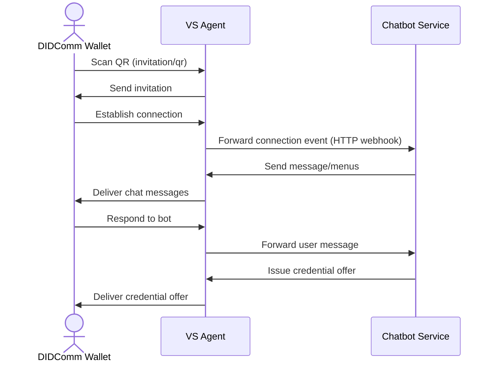

# Chatbot Example

## Overview

The Chatbot example demonstrates a VS Agent–powered conversational service that issues and manages Verifiable Credentials (VCs) via a DIDComm wallet. It shows how to:

- Run the VS Agent gateway and Chatbot service locally
- Establish a secure connection with a DIDComm wallet (e.g., Hologram)
- Exchange messages and interactive menus
- Issue a sample `phoneNumber` credential

## Prerequisites

- Docker & Docker Compose installed
- A modern web browser to view invitation URLs or QR codes
- A DIDComm-compatible wallet (e.g., Hologram mobile app)

## Installation

1. Clone the repository and navigate to the example:

   ```bash
   git clone https://github.com/verana-labs/vs-agent.git
   cd vs-agent/examples/chatbot
   ```

## Running Locally

1. Build and start services:

   ```bash
   docker-compose up --build
   ```

2. Check logs for:
   - VS Agent on port `3001`
   - Chatbot service on port `5000`
3. Obtain a connection invitation in one of two ways:
   - **Web endpoint**: Visit `http://localhost:3001/invitation` to be redirected to a QR code page.
   - **Direct QR**: Fetch the raw QR code from VS Agent at `http://localhost:3001/invitation/qr` (no redirect). Scan the displayed QR with your wallet app.
4. Scan the QR code with your wallet and accept the connection.

## Usage

- **Menus & Commands**: Type or select menu options like `help`, `quotes`, or `poll`.
- **Credential Issuance**: At prompts, the bot offers a `phoneNumber` credential. Approve to receive it.
- **Free-form Q&A**: Send messages to see scripted responses.

## Configuration

### Key Configuration Files

#### `data.ts`

Defines mock data and flow definitions for the Chatbot service. Configure:

- **quotes**: array of strings for the `quotes` command.
- **pollOptions**: poll choices for the `poll` command.
- **mainMenu**: supported commands and descriptions.

Customize by editing `examples/chatbot/src/data.ts`. For example:

```ts
// examples/chatbot/src/data.ts
export const quotes = [
  'The only limit to our realization of tomorrow is our doubts of today.',
  "Life is what happens when you're busy making other plans.",
  // ... add your custom quotes
]

export const pollOptions = [
  { id: 'A', label: 'Team A' },
  { id: 'B', label: 'Team B' },
  // ... add additional options
]

export const mainMenu = [
  { command: 'help', description: 'Show available commands' },
  { command: 'quotes', description: 'Get a random quote' },
  { command: 'poll', description: 'Start a poll' },
  // ... extend menu commands
]
```

#### `phone-cred-def-dev.json`

Contains the ANoCreds credential definition for issuing the `phoneNumber` VC:

- **schema**: attribute names (e.g., `phoneNumber`).
- **credentialDefinition**: public keys and revocation settings.
- **credentialDefinitionPrivate**: private key material (not used at runtime).

The Chatbot service loads and registers this file with VS Agent on startup. To adjust the credential schema or parameters, update this JSON and redeploy. For example:

```json
// examples/chatbot/phone-cred-def-dev.json
{
  "schema": {
    "name": "phoneNumber",
    "version": "1.0",
    "attributes": ["phoneNumber"]
  },
  "credentialDefinition": {
    "tag": "dev",
    "value": {
      "primary": {
        /* public key data */
      },
      "revocation": {
        /* revocation params */
      }
    }
  }
  // ... additional fields
}
```

#### Other configurations

- Disable redirect to pure invitation URL:

```bash
export REDIRECT_DEFAULT_URL_TO_INVITATION_URL=false
```

- Adjust ports or service names in `docker-compose.yml`.

## Flow Diagram



## Troubleshooting

- If port `3001` is in use, stop other services or change the VS Agent port.
- Review Chatbot container logs for errors: `docker-compose logs chatbot`.
