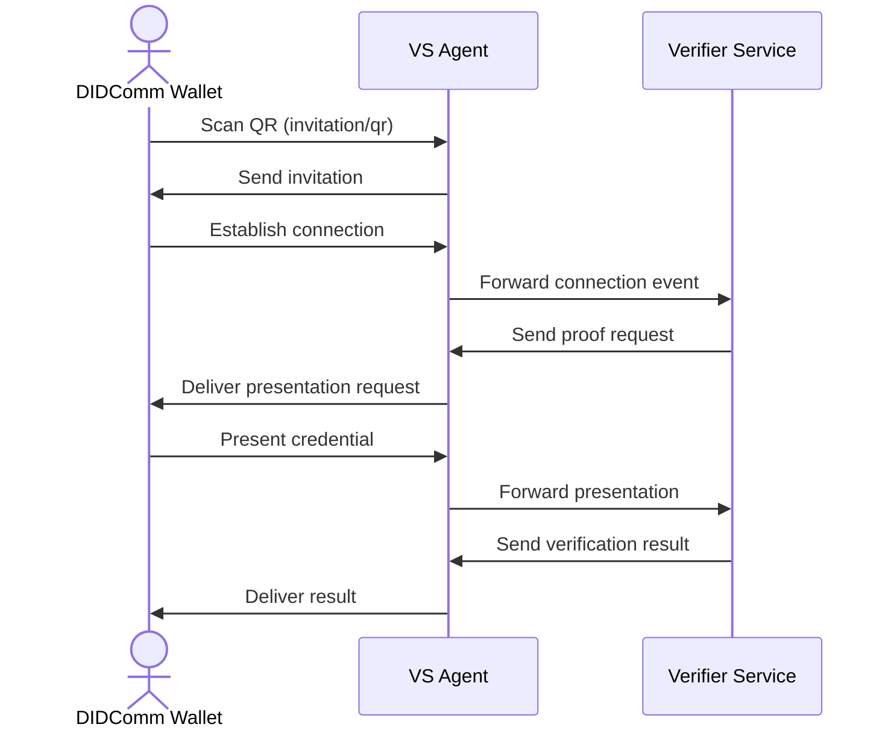

# Verifier Example

## Overview

This example shows how to request and verify a Verifiable Credential presentation from a connected user. It covers:

- Sending a proof request
- Validating the received credential
- Handling success or failure flows

## Prerequisites

- Docker & Docker Compose
- A credential already stored in your wallet (issue via the Chatbot example)

## Installation

```bash
cd vs-agent/examples/verifier
```

## Running Locally

1. Start services:

   ```bash
   docker-compose up --build
   ```

2. Services:
   - VS Agent → port `3001`
   - Verifier backend → port `5000`
3. Obtain connection via:
   - Web: `http://localhost:3001/invitation`
   - QR: `http://localhost:3001/invitation/qr`
4. Scan QR in your wallet and accept.

## Flow Diagram



## Usage

- Upon connection, the Verifier sends a proof request for the credential.
- Approve the presentation in your wallet.
- Wallet shows verification result (✅ or ❌).

## Configuration

- Modify requested credential type in `src/index.ts`.
- Adjust ports or URLs in `docker-compose.yml`.

## Troubleshooting

- If you lack the requested credential, run the Chatbot example first.
- View logs: `docker-compose logs verifier`.
