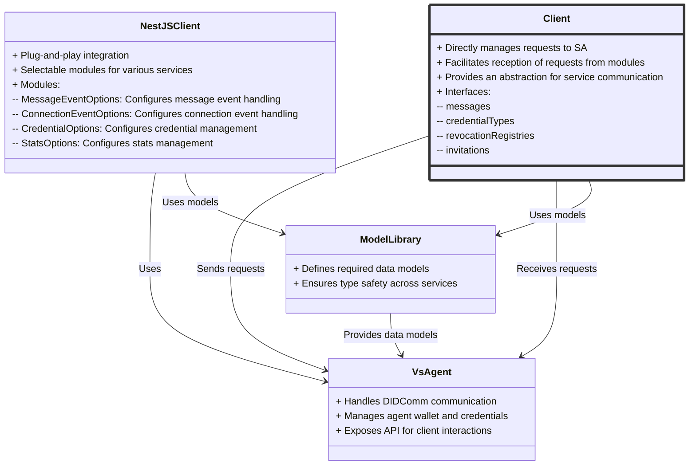

`@verana-labs/vs-agent-client`

# VS Agent Client
**VS Agent Client** is a TypeScript library designed to simplify the interaction with [**VS Agent**](https://github.com/verana-labs/vs-agent). It provides an abstraction layer for communicating with the agent, handling messaging, credential management, and event handling efficiently.

This package ensures that the client stays updated with the latest API versioning of the **VS Agent** to maintain compatibility with evolving endpoints.

## Features
- **Simplified API interaction:** Provides an easy-to-use client to interact with VS Agent.
- **Event handling:** Includes an ExpressEventHandler for quick integration into Express-based applications.
- **Service-based structure:** Dedicated services for messaging, credentials, invitations, and revocation registries.
- **Versioning support:** Supports API versioning to maintain compatibility with different VS Agent versions.

## Repository
Find the public repository here: [VS Agent](../../README.md)

## How it works


## Installation
```sh
npm install @verana-labs/vs-agent-client
```
or 
```sh
yarn add @verana-labs/vs-agent-client
```
or 
```sh
pnpm add @verana-labs/vs-agent-client
```
## `ApiClient.ts`
`ApiClient` class provides a simple interface for interacting with VS Agent. It abstracts API calls and offers dedicated service methods for messaging, credential types, invitations, and revocation registries.

### Example Usage
```ts
import { ApiClient, ApiVersion } from '@verana-labs/vs-agent-client'

const apiClient = new ApiClient('http://localhost:3000', ApiVersion.V1)

// Sending a message
const messageId = await apiClient.messages.send(
  new TextMessage({
  connectionId: 'connectionId',
  content: 'Hello, world!',
  })
)

console.log(`Message sent with ID: ${messageId}`)
```

### Services
- `messages:` Handles message sending and receiving.
- `credentialTypes:` Manages credential types.
- `revocationRegistries:` Manages revocation registries.
- `invitations:` Handles connection invitations.

## `ExpressEventHandler.ts`
The `ExpressEventHandler` simplifies event handling for Express applications, mapping API endpoints to event handlers.
### Example Usage
```ts
import express from 'express'
import { ExpressEventHandler } from '@verana-labs/vs-agent-client'

const app = express()
const eventHandler = new ExpressEventHandler(app)

expressHandler.messageStateUpdated(async (req, res) => {
  const obj = req.body
  logger.info(`message state updated: ${JSON.stringify(obj)}`)
  res.json({ message: 'ok' })
})

app.listen(3000, () => console.log('Server running on port 3000'))
```
### Available Event Handlers
- `connectionStateUpdated` (`POST /connection-state-updated`)
- `messageStateUpdated` (`POST /message-state-updated`)
- `messageReceived` (`POST /message-received`)

## Contributing
This library evolves alongside VS Agent. Contributions are welcome!
- Fork the repository.
- Create a feature branch.
- Commit changes.
- Open a pull request.

For more details, visit the [official repository](https://github.com/verana-labs/vs-agent).