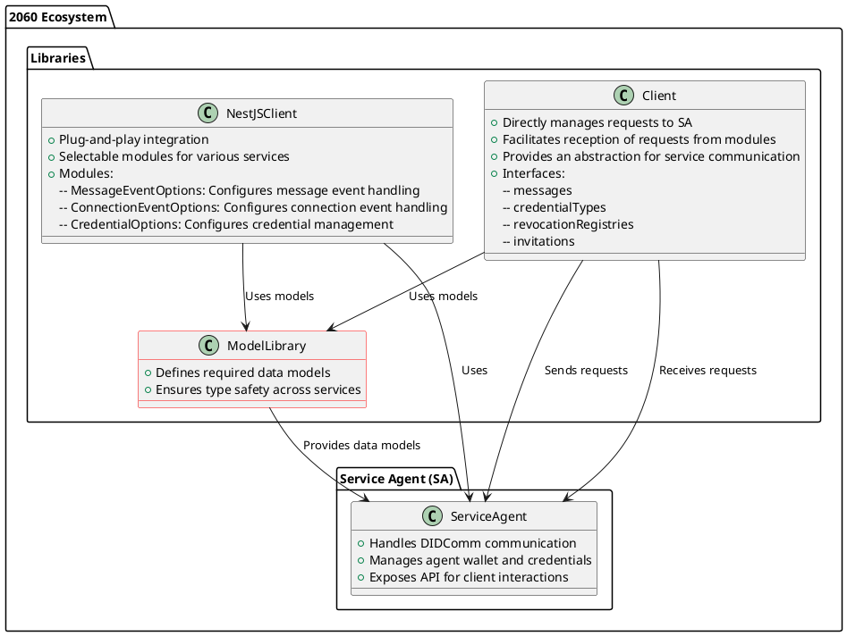

`@2060.io/service-agent-model`
# Service Agent Model

This package provides the data models used by **Service Agent** and its related services and libraries within the `@2060.io` ecosystem. These models are essential for chatbot development and facilitate integration with the broader system.

## Packages Using This Library

The models in this package are used by the following services and libraries:

- **[@2060.io/service-agent-main](../../README.md)** – The core Service Agent.
- **[@2060.io/service-agent-nestjs-client](../nestjs-client/README.md)** – A NestJS client for interacting with the Service Agent.
- **[@2060.io/service-agent-client](../client/README.md)** – A general-purpose api client for the Service Agent.


## Usage

This package defines essential models that support structured communication and event handling within the Service Agent ecosystem. It is designed to be used by chatbot services and other integrations that rely on a standardized message format.

## How to work


### Installation

```sh
npm install @2060.io/service-agent-model
```
or
```sh
yarn add @2060.io/service-agent-model
or
```sh
pnpm add @2060.io/service-agent-model
```

## Example

Importing and using a message model:

```typescript
import { CallOfferRequestMessage } from '@2060.io/service-agent-model';

const callOffer = new CallOfferRequestMessage({
    connectionId: 'connectionId',
    description: 'Start call',
    parameters: { wsUrl, roomId, peerId },
});

console.log(callOffer);
```
