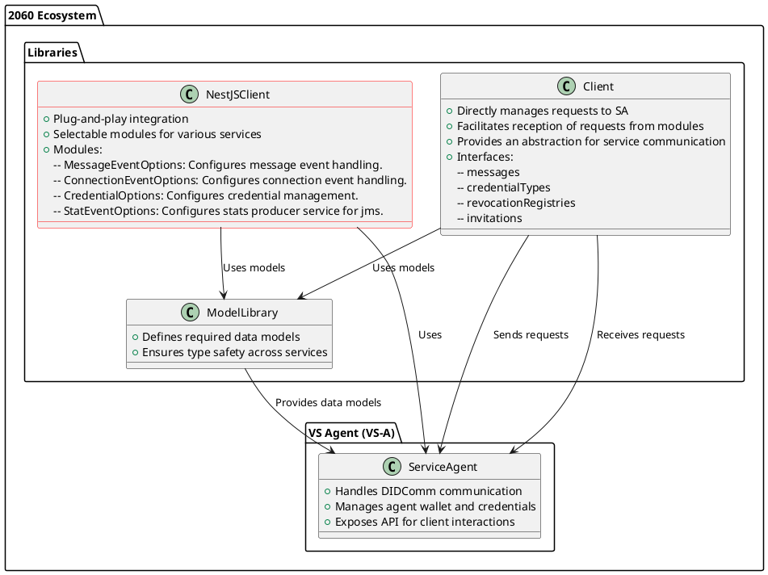

`@2060.io/vs-agent-nestjs-client`
# Nestjs-client for VS Agent
The `nestjs-client` library simplifies the integration of VS Agent components in your NestJS applications. It provides several modules that follow a plug-and-play architecture, allowing you to incorporate them based on your needs. Certain modules, such as credential management, recommend using the message handling module for seamless operation.

## Available Modules
1. Message Handling:
    - Manages the events related to message states, including when a message is sent, delivered, or received.
    - Use this module if you're integrating messaging functionality into your application.
2. Credential Management:
    - Handles the lifecycle of credentials, including offering, accepting, rejecting, and revoking credentials.
    - This module is typically used when you need to manage digital credentials for your application.
3. Connection Management:
    - Manages events related to connection state changes.

## How to work


## Configuration
### Dynamic Module Setup
The `nestjs-client` allows dynamic configuration through various module options defined in `types.ts`. You can configure individual modules or the `EventsModule` for handling multiple events at once
### Key Configuration Options
- `eventHandler`: Specifies the event handler class to handle incoming events. It must implement the `EventHandler` interface.
- `imports`: An array of additional modules to import, such as service modules or other shared functionality.
- `url`: VS Agent Admin API URL
- `version`: Specifies the version of VS Agent API to use.
- `statOptions`: Configuration options for the **JMS (Jakarta Message Service) broker**, including host, port, queue name, authentication, and reconnection settings. The default broker used is **Apache Artemis**. 

### `statOptions` Parameters  
The `statOptions` object includes the following properties for configuring the message broker:  

| Parameter       | Type      | Description |
|---------------|---------|-------------|
| `host`        | `string`  | The hostname or IP address of the JMS broker. |
| `port`        | `number`  | The port used to connect to the JMS broker. |
| `queue`       | `string`  | The name of the message queue to use. |
| `username`    | `string`  | The username for authenticating with the broker (if required). |
| `password`    | `string`  | The password for authentication (if required). |
| `reconnectLimit` | `number` | The maximum number of reconnection attempts in case of a connection failure. |
| `threads`     | `number`  | The number of worker threads for processing messages. |
| `delay`       | `number`  | The delay (in milliseconds) before retrying a failed connection or message processing. |

#### `MessageEventOptions`
Configures message event handling. The following properties are available:
- `eventHandler` (optional).
- `imports` (optional).
- `url` (mandatory).
- `version` (optional).
#### `ConnectionEventOptions`
Configures connection event handling. The following properties are available:
- `eventHandler` (optional).
- `imports` (optional).

#### `CredentialOptions`
Configures credential management. The following properties are available:
- `imports` (optional).
- `url` (mandatory).
- `version` (optional).

#### `StatsOptions`
Configures stats management. The following properties are available:
- `imports` (optional).
- `statOptions` (optional).

#### `ModulesConfig`
This interface defines the configuration for enabling or disabling modules:
- `messages` (optional): Whether to enable the message handling module. Defaults to false.
- `connections` (optional): Whether to enable the connection management module. Defaults to false.
- `credentials` (optional): Whether to enable the credential management module. Defaults to false.
- `stats` (optional): Whether to enable the stats management module. Defaults to false.

#### `EventsModuleOptions`
This configuration interface is used to configure multiple modules at once via the EventsModule:
- `modules`: Specifies which modules to enable (messages, connections, and credentials).
- `options`: Contains common configuration options that apply to each module, such as eventHandler, imports, url, and version.


### Example of Using Independent Modules
This example demonstrates how to use each module separately:
```typescript
@Module({
  imports: [
    MessageEventModule.forRoot({
      messageHandler: CustomMessageHandler, // Class with input method
      imports: [],
      url: 'http://vsa-url.com',
      version: ApiVersion.V1,
    }),
    CredentialManagementModule.forRoot({
      // Configuration options
    }),
  ],
})
export class AppModule {}
```

###  Example of Using the Recommended `EventsModule`
The recommended approach is to use the `EventsModule` to register multiple modules at once for easier configuration:
```typescript
@Module({
  imports: [
    EventsModule.register({
      modules: {
        messages: true,
        credentials: true,
      },
      options: {
        eventHandler: CoreService,
        imports: [],
        url: process.env.VS_AGENT_ADMIN_URL,
        version: ApiVersion.V1,
      },
    }),
  ],
})
export class AppModule {}
```
In this example, the `EventsModule` is used to register multiple modules simultaneously, which ensures better integration and streamlined configuration for common use cases.

For more information on dynamic modules and their configuration in NestJS, refer to the official [documentation](https://docs.nestjs.com/fundamentals/dynamic-modules)