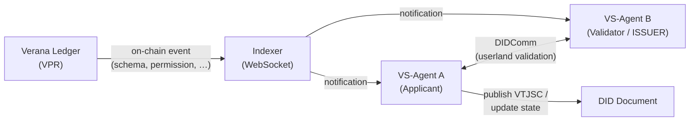

# VS-Agent Core Add-on Specification

> **Version**: 0.1.0 (draft)
> **Status**: Draft
> **Compliance target**: Verifiable Trust Spec v4, VPR Spec v4

## 1. Overview

Resources created in the Verana ledger (a VPR) are linked to DIDs that represent VS-Agents. For this reason, a VS-Agent MUST receive notifications of changes in the ledger that are directly or indirectly linked to its DID, and update its state accordingly.

**Examples:**

- **Trust registry schema addition** — A new credential schema is created for a trust registry. The VS-Agent whose DID owns that trust registry is notified and automatically creates the corresponding VTJSC, publishing it in its DID Document.
- **Validation process lifecycle** — An applicant initiates a validation process to obtain a HOLDER permission from an ISSUER for a given credential schema. The applicant creates the Validation Process on the Verana ledger. The VS-Agents of both applicant and validator (ISSUER) are notified and begin a userland validation flow over DIDComm. As the on-chain permission state changes, the respective VS-Agents receive further notifications and execute follow-up tasks (e.g., continuing the DIDComm exchange, issuing the credential).



*Figure 1 — VS-Agent reactive loop. On-chain events in the VPR are relayed by the Indexer to the affected VS-Agents, which then coordinate over DIDComm and publish artefacts to their DID Documents.*

> Note: this spec only shows add-ons to the existing VS-Agent. Full VS-Agent functionality is not covered here.


### 1.1 Conformance

The key words "MUST", "MUST NOT", "REQUIRED", "SHALL", "SHALL NOT", "SHOULD", "SHOULD NOT", "RECOMMENDED", "MAY", and "OPTIONAL" in this document are to be interpreted as described in [BCP 14](https://datatracker.ietf.org/doc/html/bcp14) [RFC 2119](https://www.rfc-editor.org/rfc/rfc2119) [RFC 8174](https://www.rfc-editor.org/rfc/rfc8174).

### 1.2 Normative References

- [Verifiable Trust Specification v4](https://verana-labs.github.io/verifiable-trust-spec/)
- [Verifiable Public Registry Specification v4](https://verana-labs.github.io/verifiable-trust-vpr-spec/)
- [DIDComm Messaging](https://identity.foundation/didcomm-messaging/spec/v2.0/)
- [W3C Verifiable Credentials Data Model v2.0](https://www.w3.org/TR/vc-data-model/)

## 2. Configuration and Bootstrap

### 2.1 Container Environment Variables

The following environment variables MUST be provided when the VS-Agent container is started.

#### 2.1.1 Identity and Authority

| Variable | Required | Description |
|---|---|---|
| `VERANA_AUTHORITY` | REQUIRED | The VPR group identifier of the authority this agent belongs to. All on-chain resources (permissions, trust registries) are owned by this authority. |
| `AGENT_VERANA_MNEMONIC` | REQUIRED | BIP-39 mnemonic used to derive the agent's Verana blockchain account. This account MUST have been granted a `VSOperatorAuthorization` by the `VERANA_AUTHORITY` group for the permissions it operates under. |

#### 2.1.2 Network Configuration

| Variable | Required | Description |
|---|---|---|
| `VERANA_RPC` | REQUIRED | Verana blockchain RPC endpoint URL (e.g., `https://rpc.testnet.verana.network`). |
| `VERANA_INDEXER` | REQUIRED | Verana indexer API URL (e.g., `https://idx.testnet.verana.network`). |
| `VERANA_RESOLVER` | REQUIRED | Verana trust resolver URL (e.g., `https://resolver.testnet.verana.network`). |
| `VERANA_CHAIN_ID` | OPTIONAL | Chain ID. |

#### 2.1.3 Agent Configuration Mode

| Variable | Required | Description |
|---|---|---|
| `VS_AGENT_MODE` | OPTIONAL | One of `standalone` or `delegated`. Default: `standalone`. See [§4.1](#41-standalone-mode). |
| `VS_DELEGATED_ISSUER_DID` | CONDITIONAL | DID of the parent Verifiable Service to contact for obtaining a Service credential. REQUIRED when `VS_AGENT_MODE` = `delegated`. |

### 2.2 Bootstrap Sequence

When the VS-Agent starts, it MUST execute the following steps in order:

1. **Validate configuration**: All REQUIRED environment variables MUST be present and well-formed. If any variable is missing or invalid, the agent MUST fail with a descriptive error.

2. **Derive Verana account**: Derive the blockchain account from `AGENT_VERANA_MNEMONIC` and store the derived address as the agent's `vs_operator` account.

3. **Connect to indexer WebSocket**: Establish a persistent WebSocket connection to the VPR indexer and subscribe to DID-related notifications for real-time awareness of on-chain changes (see [§7](#7-indexer-websocket-subscription)). Subscription returns a `block-height`. Query the indexer for all objects linked to the agent's DID at `block-height - 1` to initialize the agent's state. Start processing WebSocket notifications from `block-height`.

4. **Start DIDComm message processor**: Begin listening for incoming DIDComm messages, including validation and issuance requests, revocation notifications, and credential updates.

---

## 3. Authority and Account Model

### 3.1 Authority (VPR Group)

As defined in the VPR Specification v4:

> An **authority** is a VPR **group** which is the owner of a specific resource in the VPR.

Resources in the VPR (trust registries, credential schemas, permissions, permission sessions) are owned by an **authority** (group), not by individual accounts. Individual Verana accounts operate on behalf of an authority through delegated authorizations.

The `VERANA_AUTHORITY` environment variable identifies the VPR group this agent belongs to.

### 3.2 Agent Account (vs_operator)

The agent's Verana account, derived from `AGENT_VERANA_MNEMONIC`, acts as the `vs_operator` for on-chain operations. This account MUST have been granted appropriate authorizations by the `VERANA_AUTHORITY` group:

- **`VSOperatorAuthorization`**: Grants the agent the right to execute `CreateOrUpdatePermissionSession` on behalf of the authority, for specific permissions. This is the ONLY authorization type used for permission sessions. See VPR Spec [AUTHZ-CHECK-3].
  - If `vs_operator_authz_with_feegrant` is `true` on the relevant permission, the authority's account covers transaction fees and the agent account does not need to be independently funded.
  - If `vs_operator_authz_with_feegrant` is `false`, the agent account MUST have sufficient balance to pay transaction fees.

---

## 4. ECS Credential Acquisition

The agent supports two modes, configured via `VS_AGENT_MODE`.

### 4.1 Standalone Mode

In standalone mode, the agent:

1. Obtains an **Organization** or **Persona** credential from an authorized issuer registered under a trusted ECS Trust Registry.
2. Links the received credential as a `LinkedVerifiablePresentation` in its DID Document.
3. Obtains an ISSUER permission for the **Service** credential schema from the same trusted ECS Trust Registry.
4. Self-issues its **Service** credential.
5. Links the **Service** credential as a `LinkedVerifiablePresentation` in its DID Document.

### 4.2 Delegated Mode

In delegated mode, the agent contacts the parent VS specified by `VS_DELEGATED_ISSUER_DID` to obtain its Service credential:

1. Obtain a **Service credential** from the parent VS via DIDComm (goal code `vt_flow`).
2. Link the received credential as a `LinkedVerifiablePresentation` in its DID Document.

The parent VS (`VS_DELEGATED_ISSUER_DID`) MUST already possess an ISSUER permission for the Service schema and MUST hold a valid Organization or Persona credential. If the agent cannot reach the parent VS or the parent VS rejects the request, the agent MUST fail with a descriptive error.

---

## 5. Validation Process and Issuance Flows

This section describes the general VS-Agent userspace protocol for the following two flows:

- Validation Process
- Credential Direct Issuance

> When credential schema management mode is set to `OPEN` for issuance or verification, no validation process is required — the applicant self-creates its permission directly. In that case, no userspace actions happen in the VS-Agent.

:::note
Applicant is always the peer that initiates a connection to Validator.
:::

### 5.1 Validation Process

This flow is used when the credential schema requires a validation process to be run between an Applicant and a Validator.

Possible Applicant/Validator combinations:

| Applicant | Validator | Schema Mode Condition |
|---|---|---|
| ISSUER_GRANTOR | ECOSYSTEM | Issuer management mode = `GRANTOR` |
| VERIFIER_GRANTOR | ECOSYSTEM | Verifier management mode = `GRANTOR` |
| ISSUER | ISSUER_GRANTOR | Issuer management mode = `GRANTOR` |
| ISSUER | ECOSYSTEM | Issuer management mode = `ECOSYSTEM` |
| VERIFIER | VERIFIER_GRANTOR | Verifier management mode = `GRANTOR` |
| VERIFIER | ECOSYSTEM | Verifier management mode = `ECOSYSTEM` |
| HOLDER | ISSUER | Applies to all modes |

```
Agent (Applicant)                  VPR (Chain)                 Agent (Validator)
     │                              │                            │
     │  1. start-perm-vp            │                            │
     │ ────────────────────────────>│                            │
     │  ← perm_id (vp_state=PENDING)│                            │
     │                              │                            │
     │  2. DIDComm connect          │                            │
     │  (goal: vt_flow)             │                            │
     │ ─────────────────────────────────────────────────────────>│
     │                              │                            │
     │  3. VR: perm_id, session_uuid│                            │
     │     cred. claims, proofs,    │                            │
     │     agent_perm_id,           │                            │
     │     wallet_agent_perm_id     │                            │
     │ ─────────────────────────────────────────────────────────>│
     │                              │                            │
     │  4. (optional) out-of-band   │                            │
     │     info collection          │                            │
     │   <─ ─ ─ ─ ─ ─ ─ ─ ─ ─ ─ ─ ─ ─ ─ ─ ─ ─ ─ ─ ─ ─ ─ ─ ─ ─>   │
     │                              │                            │
     │                              │  5. set-perm-vp-validated  │
     │                              │<───────────────────────────│
     │                              │                            │
     │   <─ ─ ─ all steps below are optional ─ ─ ─ ─ ─ ─ ─ ─>    │
     │                              │                            │
     │                              │                            │
     │                              │  6. Generate credential    │
     │                              │    (sign + compute digest) │
     │                              │                            │
     │                              │  7. createOrUpdate         │
     │                              │     PermissionSession      │
     │                              │<───────────────────────────│
     │                              │                            │
     │  8. Credential offer         │                            │
     │ <─────────────────────────────────────────────────────────│
     │                              │                            │
     │  9. Verify validator + digest│                            │
     │ ────────────────────────────>│                            │
     │                              │                            │
     │  10. Accept Credential       │                            │
     │ ─────────────────────────────────────────────────────────>│
     │                              │                            │
     │  11. Store credential        │                            │
     │                              │                            │
     │  12. (optional) VP in DID Doc│                            │
   ```

**Step-by-step**:

1. The agent submits `start-perm-vp` on-chain, referencing the validator permission's `validator_perm_id`. This creates a permission with `vp_state=PENDING`.

2. The agent connects to the validator via DIDComm using goal code `vt_flow` (see [§5.4](#54-didcomm-message-summary-for-vt_flow)). The validator MUST verify that the connecting agent is a Verifiable Service as specified in [VS-CONN-VS] before accepting the connection.

3. The applicant sends a **VR (Validation Request)** message containing the following (to be used later for `createOrUpdatePermissionSession`):
   - `perm_id`: The applicant permission ID.
   - `session_uuid`: A UUID for the permission session.
   - `agent_perm_id` and `wallet_agent_perm_id`: If the applicant's Service credential was issued by another agent (delegated mode), these are the `validator_perm_id` of the applicant's permission of that Service credential's validator. If the Service credential is self-issued (standalone mode), these are the `id` of the applicant's own Service credential ISSUER permission.

   The applicant MAY also include credential claims (if flow should issue a credential), and supporting proofs, if already available. The validator MUST either accept the information and proceed, or refuse it with an error code and descriptive error message. If refused, the applicant MAY retry with corrected information.

> Note: this validation request must be executed when a new validation process is started or if an existing validation process is renewed.

4. If the validator requires additional information to generate the credential (e.g., missing claims or proofs), the validator MAY send a link to the applicant for an out-of-DIDComm flow (such as a web form or portal) to collect the missing data.

5. After validation, the validator calls `set-perm-vp-validated` on-chain, changing `vp_state` to `VALIDATED`.

All steps below are optional and executed only if the validator issues a credential.

6. The validator generates and signs the credential, and computes the digest.

7. The **validator** calls `createOrUpdatePermissionSession` on-chain (see [§5.7](#57-authorization)). The credential MUST NOT be delivered until this transaction succeeds.

8. The validator delivers the signed credential to the applicant via the existing DIDComm session.

9. The applicant MUST verify the received credential before accepting it:
   - Verify the validator is authorized by the ecosystem to issue credentials for this schema.
   - Recompute the credential's digest and verify it matches the digest recorded on-chain in the permission session created in step 7.
   - If either check fails, the applicant MUST reject the credential and log the error.

10. The applicant sends a **CRED_ACCEPT** message to the validator, confirming that the credential has been verified and accepted.

11. The applicant stores the credential in its credential store.

12. **Optionally**, the applicant links the credential as a `LinkedVerifiablePresentation` in its DID Document per [VT-CRED-W3C-LINKED-VP]. This is required for ECS credentials but optional for other credential types.

### 5.2 Credential Direct Issuance

This flow is used when an applicant wants to obtain a credential that can be issued directly without an on-chain validation process.

Possible Applicant/Validator combinations:

| Applicant | Validator | Schema Mode Condition |
|---|---|---|
| HOLDER | ISSUER | Applies to all modes |

Additional Conditions:

- This flow cannot be used if the validator permission declares `validation_fees` > 0.
- Validator MAY refuse this flow even if `validation_fees` = 0.

```
Agent (Applicant)               VPR (Chain)                 Agent (Validator)
     │                              │                            │
     │  1. DIDComm connect          │                            │
     │  (goal: vt_flow)             │                            │
     │ ─────────────────────────────────────────────────────────>│
     │                              │                            │
     │  2. IR: schema_id, cred.     │                            │
     │     claims, proofs,          │                            │
     │     session_uuid,            │                            │
     │     agent_perm_id,           │                            │
     │     wallet_agent_perm_id     │                            │
     │ ─────────────────────────────────────────────────────────>│
     │                              │                            │
     │  3. (optional) out-of-band   │                            │
     │     info collection          │                            │
     │   <─ ─ ─ ─ ─ ─ ─ ─ ─ ─ ─ ─ ─ ─ ─ ─ ─ ─ ─ ─ ─ ─ ─ ─ ─ ─>   │
     │                              │                            │
     │                              │  4. Generate credential    │
     │                              │    (sign + compute digest) │
     │                              │                            │
     │                              │  5. createOrUpdate         │
     │                              │     PermissionSession      │
     │                              │<───────────────────────────│
     │                              │                            │
     │  6. Credential offer         │                            │
     │ <─────────────────────────────────────────────────────────│
     │                              │                            │
     │  7. Verify validator + digest│                            │
     │ ────────────────────────────>│                            │
     │                              │                            │
     │  8. Accept Credential        │                            │
     │ ─────────────────────────────────────────────────────────>│
     │                              │                            │
     │  9. Store credential         │                            │
     │                              │                            │
     │  10. (optional) VP in DID Doc│                            │
     │                              │                            │
```

**Step-by-step**:

1. The agent connects to the validator via DIDComm using goal code `vt_flow` (see [§5.4](#54-didcomm-message-summary-for-vt_flow)). The validator MUST verify that the connecting agent is a Verifiable Service as specified in [VS-CONN-VS] before accepting the connection.

2. The applicant sends an **IR (Issuance Request)** message containing the desired credential `schema_id`, along with the following session parameters (to be used later for `createOrUpdatePermissionSession`):
   - `session_uuid`: A UUID for the permission session.
   - `agent_perm_id` and `wallet_agent_perm_id`: If the applicant's Service credential was issued by another agent (delegated mode), these are the `validator_perm_id` of the applicant permission of that Service credential's validator. If the Service credential is self-issued (standalone mode), these are the `id` of the applicant's own Service credential ISSUER permission.

   The applicant MAY also include credential claims and supporting proofs if already available. The validator MUST either accept the information and proceed, or refuse it with an error code and descriptive error message. If refused, the applicant MAY retry with corrected information.

3. If the validator requires additional information to generate the credential (e.g., missing claims or proofs), the validator MAY send a link to the applicant for an out-of-DIDComm flow (such as a web form or portal) to collect the missing data.

4. The validator generates and signs the credential, and computes the digest.

5. The **validator** calls `createOrUpdatePermissionSession` on-chain (see [§5.7](#57-authorization)). The credential MUST NOT be delivered until this transaction succeeds.

6. The validator delivers the signed credential to the applicant via the DIDComm session.

7. The applicant MUST verify the received credential before accepting it:
   - Verify the validator is authorized by the ecosystem to issue credentials for this schema (query the VPR via the indexer to confirm the validator has an active ISSUER permission).
   - Recompute the credential's digest and verify it matches the digest recorded on-chain in the permission session created in step 5.
   - If either check fails, the applicant MUST reject the credential and log the error.

8. The applicant sends a **CRED_ACCEPT** message to the validator, confirming that the credential has been verified and accepted.

9. The applicant stores the credential in its credential store.

10. **Optionally**, the applicant links the credential as a `LinkedVerifiablePresentation` in its DID Document per [VT-CRED-W3C-LINKED-VP]. This is required for ECS credentials but optional for other credential types.

> Note: revocation status of a credential issued without a corresponding HOLDER permission must be managed by the validator with a revocation list.

### 5.3 Validator Updates

Validator MAY send update messages to the applicant through the persistent DIDComm session. The following updates are defined:

The validator sends a `CRED_STATE_CHANGE` message when the credential's status changes. Supported states:

- **REVOKED**: The credential has been permanently revoked by the validator. The applicant MUST:
  1. Remove the corresponding `LinkedVerifiablePresentation` from its DID Document (if present).
  2. Delete the credential from the credential store.

> Note: DIDComm connection can be maintained for future updates: a revocation of a credential doesn't imply the end of the flow.

### 5.4 DIDComm Message Summary for `vt_flow`

The following table lists all DIDComm message types exchanged within a `vt_flow` session:

| Type | Name | Sender | Description |
| --- | --- | --- | --- |
| `VR` | Validation Request | Applicant | Requests validation process. Contains `perm_id`, `session_uuid`, `agent_perm_id`, `wallet_agent_perm_id`, and optionally credential claims and proofs (see [§5.1](#51-validation-process) step 3). |
| `IR` | Issuance Request | Applicant | Requests direct issuance of a credential of a given schema. Contains `schema_id`, `session_uuid`, `agent_perm_id`, `wallet_agent_perm_id`, and optionally credential claims and proofs (see [§5.2](#52-credential-direct-issuance) step 2). |
| `OOB_LINK` | Out-of-Band Link | Validator | Provides a URL for out-of-DIDComm information collection (e.g., web form or portal) when additional data is needed to generate the credential, and a descriptive message. |
| `VALIDATING` | In validation process | Validator | Requested additional information submitted by the applicant via the OOB link; currently under validation. |
| `CRED_OFFER` | Credential Offer | Validator | Delivers the signed credential to the applicant after on-chain `createOrUpdatePermissionSession` succeeds. |
| `CRED_ACCEPT` | Accept Credential Offer | Applicant | Confirms the applicant has verified and accepted the offered credential (validator authorization + digest match). |
| `CRED_STATE_CHANGE` | Credential State Change | Validator | Notifies the applicant of a credential status change. Includes the new state (`REVOKED`) and a reason (see [§5.3](#53-validator-updates)). |
| `ERROR` | Generic Error Message | Validator | Contains one of the following error codes: `IR_REQUIRED`, `VR_REQUIRED`, `INVALID_CLAIMS`, `INVALID_SCHEMA`, `INVALID_PERM_ID`, `INVALID_AGENT_PERM_ID`, `INVALID_WALLET_AGENT_PERM_ID`, and a descriptive error message. |

### 5.5 Additional Considerations

- **Credential update**: At any time, the validator MAY send an updated credential to the applicant via a `CRED_OFFER` message through the existing DIDComm session. Upon receiving an updated credential, the applicant MUST delete the old credential from the credential store, replace it with the new one, and update the corresponding `LinkedVerifiablePresentation` in its DID Document if the credential was previously linked.
- **Out-of-band requests**: At any time, the validator MAY send an `OOB_LINK` message — for example, to revalidate applicant information, to extend a permission lifetime, or to collect additional data before issuing an updated credential.
- **Reconnection**: If the applicant reconnects to the validator after a connection has been closed, it MUST resend a `VR` or `IR` message. The validator MUST identify that the message is related to an existing flow and reassign the flow to the new connection.
- **Validation renewal**: When a validation process must be renewed, the applicant MUST first execute the required VPR on-chain transaction and then resend a `VR` message to the validator to re-trigger validation.

### 5.6 Flow State

Each credential acquisition flow has two orthogonal state dimensions that can be queried through the Administration API:

- **Connection State**: State of the DIDComm connection (`NOT_CONNECTED`, `ESTABLISHED` or `TERMINATED`).
- **Flow State**: Current stage of the credential acquisition flow.

| Connection State | Flow State | Role | Flow | Description |
| --- | --- | --- | --- | --- |
| `NOT_CONNECTED` | `AWAITING_VP` | Applicant | §5.1 | Waiting for the applicant to start/renew an on-chain VP. |
| `ESTABLISHED` | `VR_SENT` | Applicant | §5.1 | VR sent to validator. |
| `ESTABLISHED` | `AWAITING_VR` | Validator | §5.1 | VR expected but not yet received, or last VR was rejected with error (applicant may retry). |
| `ESTABLISHED` | `IR_SENT` | Applicant | §5.2 | IR sent to validator. |
| `ESTABLISHED` | `AWAITING_IR` | Validator | §5.2 | IR expected but not yet received, or last IR was rejected with error (applicant may retry). |
| `ESTABLISHED` | `OOB_PENDING` | Both | Both | Validator sent an `OOB_LINK` for out-of-band information collection; awaiting applicant completion. |
| `ESTABLISHED` | `VALIDATING` | Both | §5.1 | Validator is performing off-chain validation of the applicant. |
| `ESTABLISHED` | `VALIDATED` | Both | §5.1 | Validator called `set-perm-vp-validated` on-chain; `vp_state` is now `VALIDATED`. |
| `ESTABLISHED` | `CRED_OFFERED` | Both | Both | Credential offered to applicant; awaiting `CRED_ACCEPT`. |
| `ESTABLISHED` | `COMPLETED` | Both | Both | Credential accepted, stored, and optionally linked as VP in DID Document. Connection remains open for future validator updates (see [§5.3](#53-validator-updates), [§5.5](#55-additional-considerations)). |
| `TERMINATED` | `TERMINATED_BY_VALIDATOR` | Both | Both | Flow terminated by the validator (e.g., rejection, timeout, or policy decision). |
| `TERMINATED` | `TERMINATED_BY_APPLICANT` | Both | Both | Flow terminated by the applicant (e.g., cancellation or timeout). |
| `TERMINATED` | `ERROR` | Both | Both | Unrecoverable error occurred; connection closed. |
| `TERMINATED` | `PERM_REVOKED` | Both | §5.1 | On-chain permission has been revoked; validator closed the connection (see [§7.2](#72-permission-notifications)). |
| `TERMINATED` | `PERM_SLASHED` | Both | §5.1 | On-chain permission has been slashed; validator closed the connection (see [§7.2](#72-permission-notifications)). |
| `ESTABLISHED` | `CRED_REVOKED` | Both | Both | Credential permanently revoked by validator (see [§5.3](#53-validator-updates)). |

### 5.7 Authorization

The `createOrUpdatePermissionSession` on-chain call requires a `VSOperatorAuthorization` for the validator's Verana account (see VPR Spec [AUTHZ-CHECK-3]):

1. A `VSOperatorAuthorization` MUST exist where `authority` = `VERANA_AUTHORITY` and `vs_operator` = validator's agent account.
2. The authorization's `permissions` list MUST include the relevant validator permission ID.
3. If `vs_operator_authz_with_feegrant` is `true`, the authority account pays fees.
4. If `false`, the validator's agent account MUST have sufficient balance.

---

## 6. Trust Registry Schema Publication

### 6.1 Automatic VTJSC Maintenance

For each Credential Schema belonging to a Trust Registry owned by the agent's DID, the agent MUST:

1. **Generate a VTJSC** (VT JSON Schema Credential) conforming to the Verifiable Trust Specification v4:
   - Type: `['VerifiableCredential', 'JsonSchemaCredential']`
   - `credentialSubject.jsonSchema.$ref`: VPR reference (e.g., `vpr:verana:vna-testnet-1/cs/v1/js/<schema_id>`)
   - `credentialSubject.digestSRI`: SRI digest of the JSON schema content
   - Signed with `Ed25519Signature2020`

2. **Wrap the VTJSC in a Verifiable Presentation** and sign it with the agent's key.

3. **Publish the VP as a `LinkedVerifiablePresentation`** service entry in the agent's DID Document. Per [VT-ECOSYSTEM-DIDDOC], the fragment MUST start with `#vpr-schemas-` and end with `-vtjsc-vp`. The middle qualifier is controller-defined and MUST be unique within the DID Document.

   Example:
   ```json
   {
     "id": "did:example:agent#vpr-schemas-example-vtjsc-vp",
     "type": "LinkedVerifiablePresentation",
     "serviceEndpoint": ["https://agent.example.com/vpr-schemas-example-vtjsc-vp.json"]
   }
   ```

4. **Serve the VP** at the `serviceEndpoint` URL via the agent's public API.

### 6.2 Synchronization

Credential Schemas in the VPR are **immutable** — they cannot be modified or removed once created. Therefore, the only change the agent needs to detect is the creation of a new Credential Schema in a Trust Registry owned by its DID.

When a new schema is detected (via the indexer WebSocket subscription — see [§7](#7-indexer-websocket-subscription)), the agent MUST automatically generate and publish the corresponding VTJSC and Linked VP as described in [§6.1](#61-automatic-vtjsc-maintenance).

---

## 7. Indexer WebSocket Subscription

The agent MUST maintain a permanent WebSocket connection to the VPR indexer and subscribe to notifications related to its own DID. The indexer tracks all on-chain objects where `did` matches the agent's DID — including Trust Registries, Credential Schemas (within those Trust Registries), Permissions, and Permission Sessions — and emits a notification whenever any of these objects is created or modified by a transaction.

If the WebSocket connection is lost, the agent MUST reconnect with exponential backoff and re-synchronize by querying the indexer REST API for any events missed during the disconnection.

The following table lists all VPR transactions that produce a notification for the subscribed agent, grouped by the agent's role.

Each notification must be associated with a specific handler interface in the VS-Agent. A default implementation will be provided to handle the most important notifications. Developers can implement their own handlers to override VS-Agent default handlers (or provide an implementation for notifications not handled by the default implementation).

### 7.1 Trust Registry Owner Notifications

These notifications are emitted when objects in a Trust Registry owned by the agent's DID (`TrustRegistry.did` = agent DID) are created or modified.

| VPR Transaction | Description | Default Handler Implementation |
| --- | --- | --- |
| `CreateNewTrustRegistry` [MOD-TR-MSG-1] | A new Trust Registry has been created with the agent's DID. | N/A. |
| `UpdateTrustRegistry` [MOD-TR-MSG-4] | The Trust Registry has been updated. | N/A. |
| `AddGovernanceFrameworkDocument` [MOD-TR-MSG-2] | A Governance Framework document has been added to the Trust Registry. | N/A. |
| `IncreaseActiveGFVersion` [MOD-TR-MSG-3] | The active Governance Framework version has been incremented. | N/A. |
| `CreateNewCredentialSchema` [MOD-CS-MSG-1] | A new Credential Schema has been created in the agent's Trust Registry. | Trigger automatic VTJSC publication (see [§6.2](#62-synchronization)). |
| `UpdateCredentialSchema` [MOD-CS-MSG-2] | A Credential Schema has been updated (e.g., validation validity periods). | N/A. |
| `ArchiveCredentialSchema` [MOD-CS-MSG-3] | A Credential Schema has been archived or unarchived. | N/A. |

### 7.2 Permission Notifications

All notifications are sent both to the Applicant and Validator.

| VPR Transaction | Description | Default Handler Implementation |
| --- | --- | --- |
| `StartPermissionVP` [MOD-PERM-MSG-1] | An applicant has started a new Validation Process targeting the DID of this agent. | For Validator: N/A. For Applicant: Progress the credential acquisition flow (see [§5.1](#51-validation-process)). |
| `RenewPermissionVP` [MOD-PERM-MSG-2] | An applicant has renewed an existing Validation Process. | For Validator: N/A. For Applicant: Progress the credential acquisition flow (see [§5.1](#51-validation-process)). |
| `SetPermissionVPToValidated` [MOD-PERM-MSG-3] | Validator has set the agent's permission `vp_state` to `VALIDATED`. | For Validator: Progress the credential acquisition flow (see [§5.1](#51-validation-process)). For Applicant: N/A. |
| `AdjustPermission` [MOD-PERM-MSG-8] | Validator or ancestor has adjusted the agent's permission `effective_until`. | N/A. |
| `RevokePermission` [MOD-PERM-MSG-9] | Validator, ancestor, or TR controller has revoked the agent's permission. | Remove linked VP from DID Document if exists, delete credential if exists. |
| `SlashPermissionTrustDeposit` [MOD-PERM-MSG-12] | Validator or TR controller has slashed the agent's permission trust deposit. | Clean up the associated flow state. |
| `RepayPermissionSlashedTrustDeposit` [MOD-PERM-MSG-13] | The agent's slashed trust deposit has been repaid (confirmation of own tx). | N/A. |
| `CancelPermissionVPLastRequest` [MOD-PERM-MSG-6] | An applicant has cancelled a pending Validation Process. | Clean up the associated flow state. |
